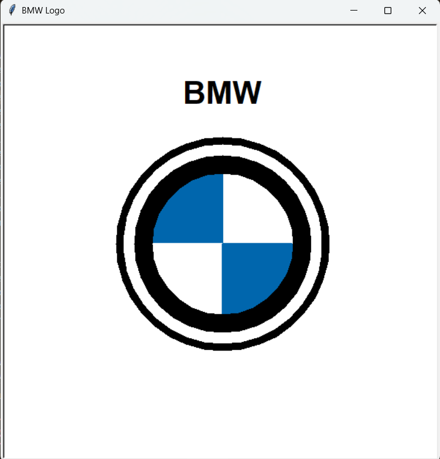

BMW Logo with Python Turtle

A simple, fun graphic project that recreates the iconic BMW logo using Python's built-in turtle graphics library.

#Preview

#Project Overview

This project was born out of pure curiosity! I wanted to see if I could accurately recreate a well-known brand logo using nothing but basic geometric shapes and Python code. The script uses coordinate geometry to draw circles, fill quadrants with specific hex colors, and render the classic "BMW" typography.

Features
*Simple Geometry: Uses nested circles to create the silver/black ring effect.

*Quadrant Rendering: Custom functions to fill the signature blue and white center.

*Custom Colors: Uses BMW-accurate hex codes (like #0066ad) for a realistic look.

*Clean Code: Organized into modular functions for easy reading and modification.

🛠️ How to Run
Prerequisites: Make sure you have Python installed on your system (Python 3.x is recommended).

No extra installs: Since turtle is part of the Python Standard Library, you don't need to pip install anything!

Run the script:
        python bmw_logo.py
